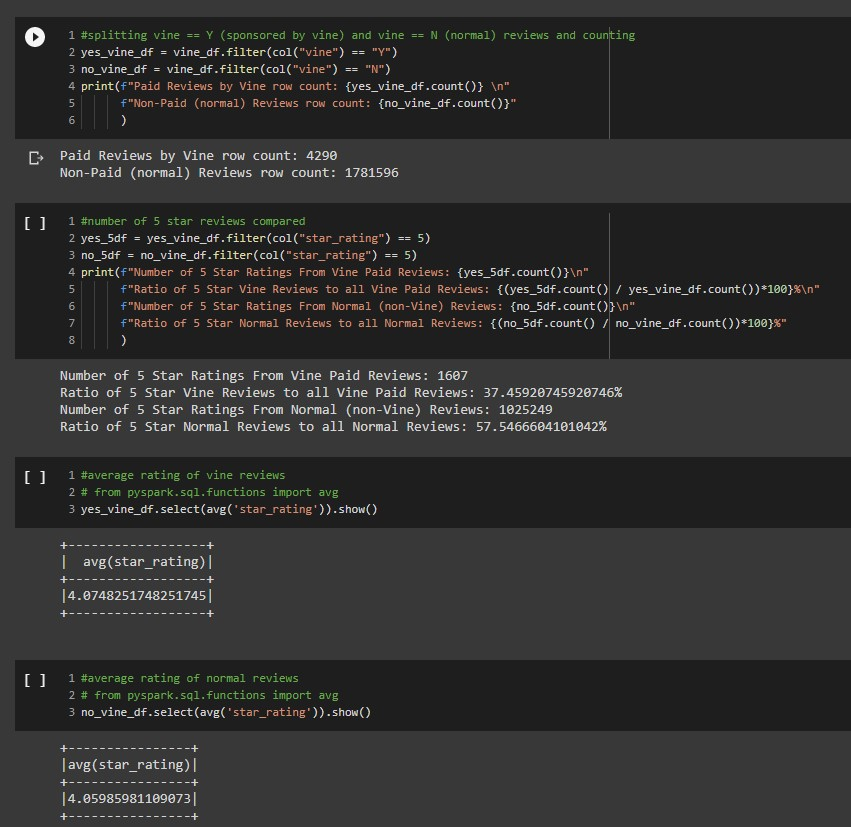

# Big_Cloud_Data
Compare and Analyze reviews of products for $ellby company vs competitors

## Objective
Perform ETL process and upload Reviews Datasets to an Amazon Relational Database Service (RDS) instance. Additionaly, utilize PySpark functions to perform a statistical analysis of select reviews ("Vine") on a certain retail website.

[ETL Google Colab Notebook](https://colab.research.google.com/drive/1-j-02-P2hePB4PRMNIUgsDhH0noo5gYW?usp=sharing)

[Review Bias Google Colab Notebook](https://colab.research.google.com/drive/14n41NRHli_cHEuPJGs5pg58m6sNxxHld?usp=sharing)

## Analysis of Vine Reviews
For this Module's Challenge, I performed ETL all in the cloud and uploaded a DataFrame to an RDS instance using PySpark, Apache, and PostgreSQL. I used PySpark to analyze the data and determine if the Vine reviews are biased. I had 1,785,886 total rows of Video Game related reviews on Amazon to parse and use basic PySpark functions to determine some metrics for Vine Reviews. First, I split the Vine Reviews from the non-paid Normal reviews. For the purpose of this challenge, I am renaming Vine sponsored reviews as "VR" and non-paid Normal reviews as "NR".

The total row count of the VR dataset was 4,290 while NR was 1,781,596. VR account .24% of the whole dataset. Then, I compared 5-star ratings, which results in VR with 1607 5-star reviews, about 37% of total VR count, whereas NR with 1,025,249 5-star reviews, about 57% of total NR count. Lastly, the average rating for VR is 4.08, while for NR is 4.06.
 
My claim is VR tends to leave more scathing/sharp reviews compared to NR as we can see from the percentage of 5 star ratings from total count. A surprising finding is the percentage of NR 5-star ratings, 57%, more than half of the dataset left 5-star reviews, a population one can call  a majority! Even though the NR count is 425 times more than that of VR count, the amount of 5-star is still surprising. There might be a correlation of VR tends to leave lower scores to implicitly try to stay true to the product, due to compensation and/or sponsorship, and gain trust of customers eyeing an item. A reason for that correlation might be due to VR having a high tendency of being the first review a customer sees while browsing reviews for an item. The average star rating is .02 points higher for VR, which can be considered as pretty insignificant in terms of any correlation or finding a substantial claim.

